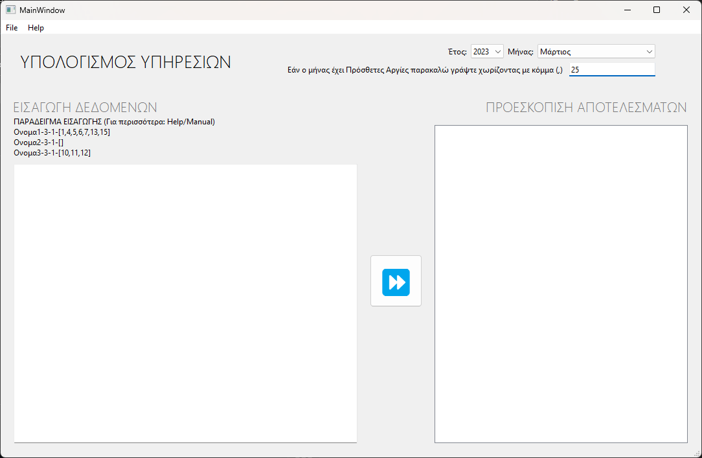
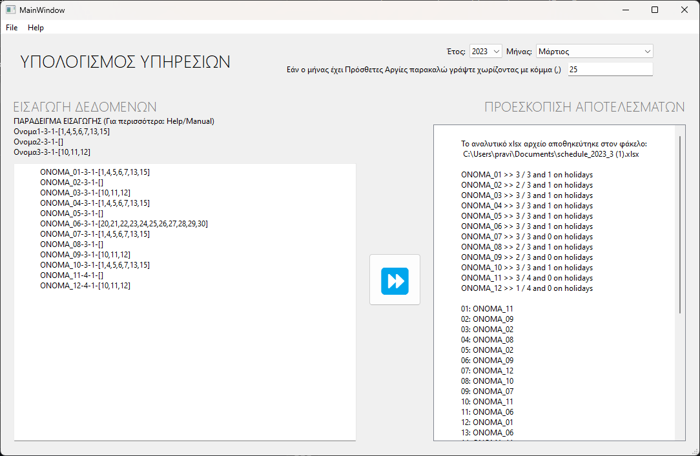

# Monthly Shift Scheduler

## Overview

The Monthly Shift Scheduler is a versatile tool that generates work schedules for a specified month and number of employees. It takes into account worker preferences, weekends, holidays, and assigns one employee to each day. The generated schedule can be exported to an Excel file for further customization.

## Features

- Schedule generation based on worker preferences.
- Handling of weekend and holiday shifts.
- Exporting schedules to an Excel file for customization.
- User-friendly graphical interface using PyQt6.
- Supports command-line mode for quick results.

## Dependencies

- [ortools](https://developers.google.com/optimization) library from Google: Specifically, `from ortools.sat.python import cp_model`.
- [PyQt6](https://riverbankcomputing.com/software/pyqt/intro) for the user interface.
- [xlsxwriter](https://xlsxwriter.readthedocs.io/) for exporting to the Windows Documents folder.

## How to Run

### Option 1: Executable (Windows)

1. Download the project as a zip file.
2. Run `Monthly_Shift_Scheduler.exe` on Windows.

### Option 2: Python Script

1. Clone the repository:

```bash
git clone https://github.com/pravi-x/monthly_shift_scheduler
cd monthly_shift_scheduler
```

2. Run the script:

```bash
python main.py
```

### Option 3: Terminal (Results Only)

If you want results only on the terminal:

```bash
python main_cmd.py
```

## Screenshots





## Author

- [pravi-x](https://github.com/pravi-x)

## Year of Development

2023

## Enjoy Using Monthly Shift Scheduler!

Feel free to contribute, report issues, or provide feedback. Your input helps improve this tool for everyone.
